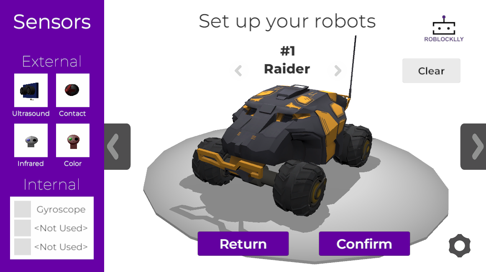
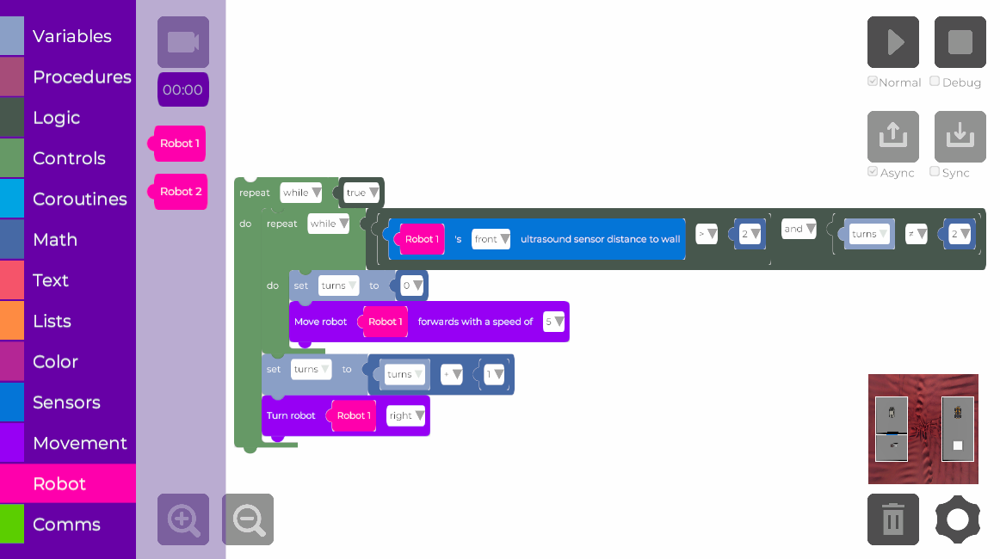

# RoblockLLy
Source code of RoblockLLy, an educational robotics simulator based on Unity and UBlockly. This version of the simulator can be accessed through the following [link](https://roblocklly.github.io/RoblockLLy-23-24/).

## Local deployment

The "src" folder contains the project in Unity version 2022.3.27f1.

